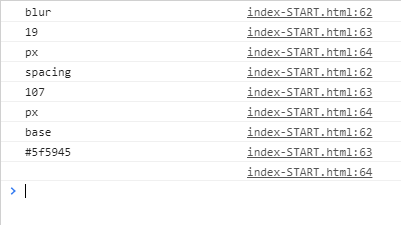

### Javascript로 CSS 제어하기

- setProperty의 경우 아래와 같이 `속성, 값`을 받아 CSS 스타일을 제어할 수 있다.

- console.log() 를 통해 `this.name`, `this.value`, `suffix`를 찍어본 결과화면.

- 즉, 위의 `document.documentElement.style.setProperty(속성, 값)`구문에서 **속성**인 this.name(blur, spacing, base)를 **값** 19(this.value) px(suffix)로 변경한다는 의미인 것.

- base는 suffix의 값이 없기 때문에 그냥 value값인 color(#5f5945)가 적용된다.

  

