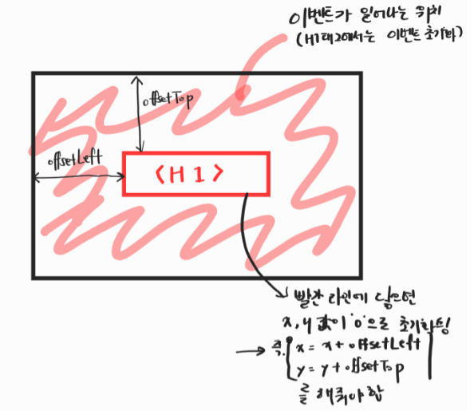

# 16_mouse move Shadow

> 이번 코드는 mousemove 이벤트로 Shadow 속성을 조작하는 과제였다.
> 흐름대로 순서를 

### 변수 생성
```javascript
  const hero = document.querySelector('.hero');
  const text = hero.querySelector('h1');
  const walk = 500; // 500px
```

### 이벤트 리스너
```javascript
  hero.addEventListener('mousemove', shadow)
```

### f_shadow
- `if (this !== e.target) ...` 구문을 쓰지 않으면, x, y값이 끊겨서 0부터 다시 시작되게 된다.
- 그 이유는, 이벤트가 발생하는 위치가 hero를 가리키고 있으므로, h1가 존재하는 위치에서 x, y값이 초기와되기 때문이다.
- 아래 이미지를 보고 이해를 돕자 !



```javascript
  function shadow(e) {
    const { offsetWidth:width, offsetHeight:height } = hero;
    let { offsetX: x, offsetY: y } = e;
    // 현재 this는 hero이고, 만약 e.target이 hero를 가리키지 않으면
    // (여기서는 h1을 가리키면 이라는 말) x, y 값을 아래 처럼 반환
    // 그러면 x, y 값이 잘 동작하게 된다.
    if (this !== e.target) {
      x = x + e.target.offsetLeft;
      y = y + e.target.offsetTop;
    }

    // 정중앙을 위치로 오른쪽이면 x값이 양수, 왼쪽이면 음수(-250, 250)
    // 위쪽이면 y값이 음수, 아래쪽이면 양수(-250, 250)
    const xWalk = Math.round((x / width * walk) - (walk / 2))
    const yWalk = Math.round((y / height * walk) - (walk / 2))

    // css속성인 text-shadow를 적용한다. (text-shadow속성은 여러개 적용가능)
    text.style.textShadow = `
      ${xWalk}px ${yWalk}px 0 rgba(255, 0, 255, 0.7),
      ${xWalk * -1}px ${yWalk}px 0 rgba(0, 255, 255, 0.7),
      ${yWalk}px ${xWalk * -1}px 0 rgba(0, 255, 0, 0.7),
      ${yWalk * -1}px ${xWalk}px 0 rgba(0, 0, 255, 0.7)
    `;
  } 
```

